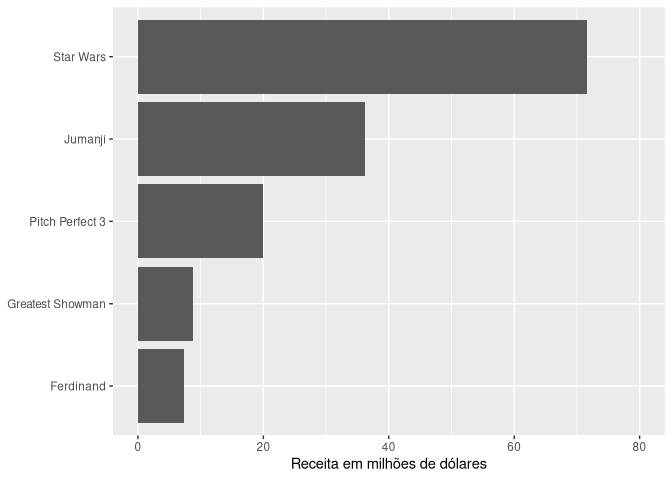
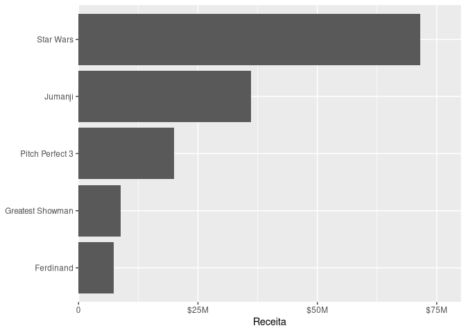
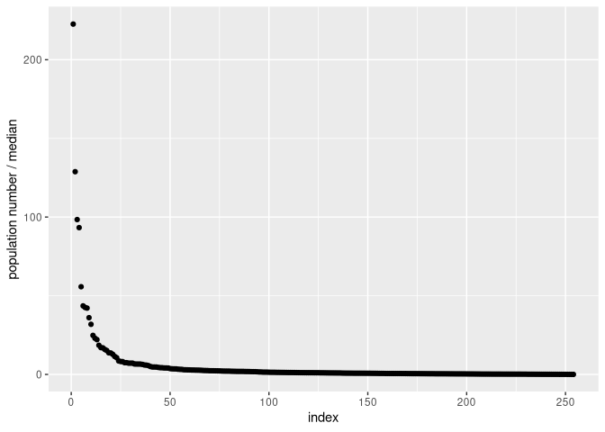
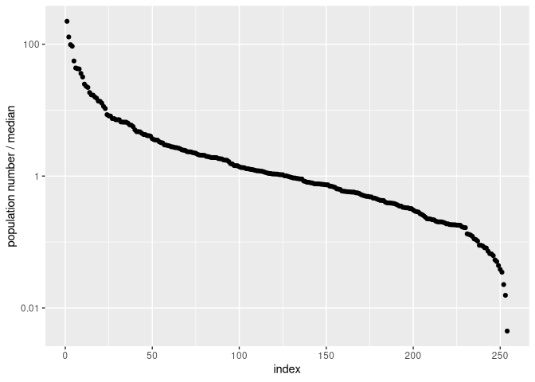
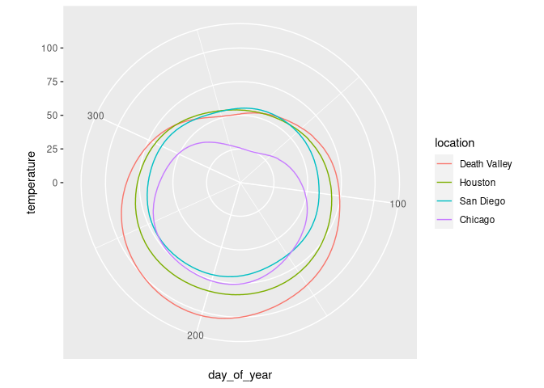

Aula 6
================

# Pacotes

``` r
library(tidyverse)
library(ggplot2)
```

# Carregando dados

``` r
boxoffice <- tibble(
  rank = 1:5,
  title = c("Star Wars", "Jumanji", "Pitch Perfect 3", "Greatest Showman", "Ferdinand"),
  amount = c(71.57, 36.17, 19.93, 8.81, 7.32) # million USD
)

temperatures <- read_csv("https://wilkelab.org/SDS375/datasets/tempnormals.csv") %>%
  mutate(
    location = factor(
      location, levels = c("Death Valley", "Houston", "San Diego", "Chicago")
    )
  ) %>%
  select(location, day_of_year, month, temperature)

US_census <- read_csv("https://wilkelab.org/SDS375/datasets/US_census.csv")
tx_counties <- US_census %>% 
  filter(state == "Texas") %>%
  select(name, pop2010) %>%
  extract(name, "county", regex = "(.+) County") %>%
  mutate(popratio = pop2010/median(pop2010)) %>%
  arrange(desc(popratio)) %>%
  mutate(index = 1:n())
```

# Parâmtros das funções de escala

## Relembrando gráfico da aula 3

``` r
boxoffice %>% 
    ggplot(aes(amount, fct_reorder(title, amount))) +
    geom_col()
```

<!-- -->

## Usando as funções que transformam os eixos

``` r
boxoffice %>% 
    ggplot(aes(amount, fct_reorder(title, amount))) +
    geom_col() +
    scale_x_continuous(name = "Receita em milhões de dólares") +
    scale_y_discrete(name = NULL)
```

<!-- -->

## Definindo o parâmetro `limits`

``` r
boxoffice %>% 
    ggplot(aes(amount, fct_reorder(title, amount))) +
    geom_col() +
    scale_x_continuous(
        name = "Receita em milhões de dólares",
        limits = c(0,80)) +
    scale_y_discrete(name = NULL)
```

<!-- -->

## Usando o parâmetro `breaks` para definir as marcações

Note que apesar do limite superior ser 80 a última marca ainda é 75

Isto é, o gráfico vai até o valor definido no parâmtro `breaks`
independente dos valores definidos no parâmetro `breaks`

``` r
boxoffice %>% 
    ggplot(aes(amount, fct_reorder(title, amount))) +
    geom_col() +
    scale_x_continuous(
        name = "Receita em milhões de dólares",
        limits = c(0,80),
        breaks = c(0, 25, 50, 75)) +
    scale_y_discrete(name = NULL)
```

<!-- -->

## O parâmetro `labels`

``` r
boxoffice %>% 
    ggplot(aes(amount, fct_reorder(title, amount))) +
    geom_col() +
    scale_x_continuous(
        name = "Receita",
        limits = c(0,80),
        breaks = c(0, 25, 50, 75),
        labels = c("0", "$25M", "$50M", "$75M")) +
    scale_y_discrete(name = NULL)
```

<!-- -->

## O parâmetro `expand`

``` r
boxoffice %>% 
    ggplot(aes(amount, fct_reorder(title, amount))) +
    geom_col() +
    scale_x_continuous(
        name = "Receita",
        limits = c(0,80),
        breaks = c(0, 25, 50, 75),
        labels = c("0", "$25M", "$50M", "$75M"),
        expand = c(0, 0.06)) +
    scale_y_discrete(name = NULL)
```

<!-- -->

# Mudanças nos eixos

## Escala linear

``` r
tx_counties %>% 
    ggplot(aes(index, popratio)) +
    geom_point() +
    scale_y_continuous(
        name = "population number / median",
        breaks = c(0, 100, 200),
    )
```

<!-- -->

## Escala logarítmica

``` r
tx_counties %>% 
    ggplot(aes(index, popratio)) +
    geom_point() +
    scale_y_log10(
        name = "population number / median",
        breaks = c(0.01, 1, 100),
        labels = c("0.01", "1", "100")
    )
```

<!-- -->

# Sistema de coordenadas

## Cartesiana

``` r
temperatures %>% 
    ggplot(aes(day_of_year, temperature, color = location)) +
    geom_line() +
    coord_cartesian()
```

<!-- -->

## Polar

Não acho que esse gráfico seja de boa leitura, apesar do autor colocá-lo
como exemplo

``` r
temperatures %>% 
    ggplot(aes(day_of_year, temperature, color = location)) +
    geom_line() +
    coord_polar() +
    scale_y_continuous(
        limits = c(0, 105)
    )
```

<!-- -->
