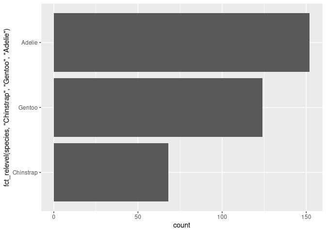
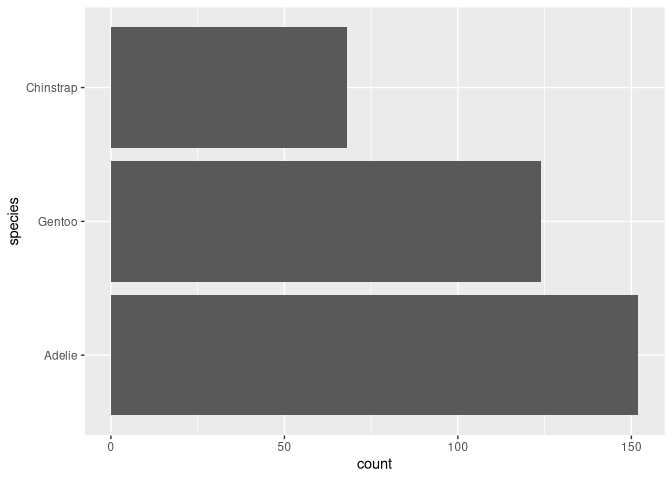
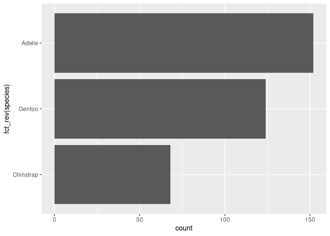
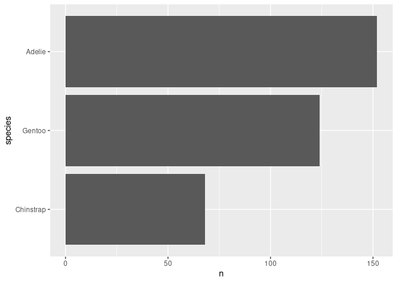
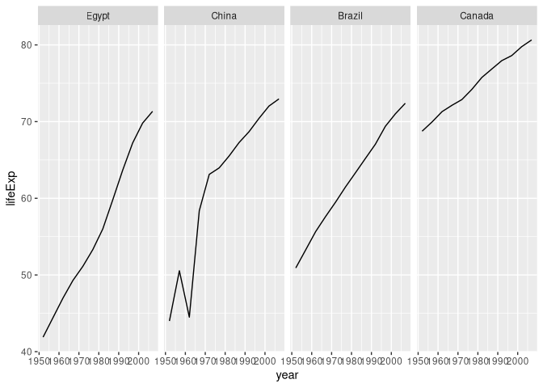
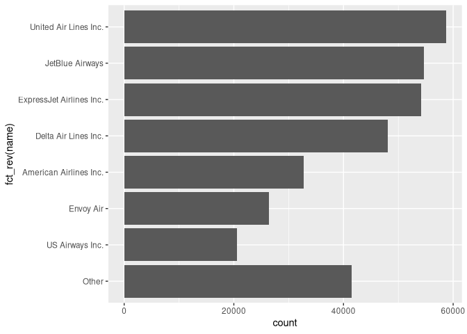
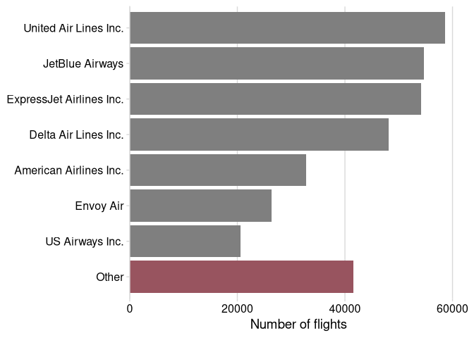

Aula 11
================

# Pacotes

``` r
library(ggplot2)
library(tidyverse)
library(nycflights13)
library(palmerpenguins)
library(gapminder)
library(cowplot)
```

# Ordenando manualmente com `fct_relevel`

``` r
penguins %>% 
    ggplot(aes(y = fct_relevel(species, "Chinstrap", "Gentoo", "Adelie"))) +
    geom_bar()
```

<!-- -->

## Deixando as coisas mais claras com `mutate`

``` r
penguins %>% 
    mutate(
        species = fct_relevel(species, "Chinstrap", "Gentoo", "Adelie")
    ) %>% 
    ggplot(aes(y = species)) +
    geom_bar()
```

<!-- -->

# Ordenando de acordo com a frenquência com `fct_infreq`

``` r
penguins %>% 
    mutate(
        species = fct_infreq(species)
    ) %>% 
    ggplot(aes(y = species)) +
    geom_bar()
```

<!-- -->

## Invertendo a ordem com `fct_rev`

``` r
penguins %>% 
    mutate(
        species = fct_infreq(species)
    ) %>% 
    ggplot(aes(y = fct_rev(species))) +
    geom_bar()
```

<!-- -->

## Ordenando com valores numéricos com `fct_reorder`

``` r
penguins %>% 
    count(species) %>% 
    mutate(
        species = fct_reorder(species, n)
    ) %>% 
    ggplot(aes(n, species)) +
    geom_col()
```

<!-- -->

# Além de gráficos de barras

## Primeiro exemplo (ruim)

``` r
gapminder %>% 
    filter(
        continent == "Americas",
        year == 2007
    ) %>% 
    ggplot(aes(lifeExp, country)) +
    geom_point()
```

<!-- -->

## Segundo exemplo (bom)

``` r
gapminder %>%
    filter(
        continent == "Americas",
        year == 2007
    ) %>% 
    mutate(
        country = fct_reorder(country, lifeExp)
    ) %>% 
    ggplot(aes(lifeExp, country)) +
    geom_point()
```

<!-- -->

# Ordenando vários gráficos

## Facet padrão em ordem alfabética

``` r
gapminder %>% 
    filter(
        country %in% c("Brazil", "China", "Canada", "Egypt")
    ) %>% 
    ggplot(aes(year, lifeExp)) +
    geom_line() +
    facet_wrap(vars(country), nrow = 1)
```

<!-- -->

## Ordenando pela média

``` r
gapminder %>% 
    filter(
        country %in% c("Brazil", "China", "Canada", "Egypt")
    ) %>% 
    mutate(
        country = fct_reorder(country, lifeExp)
    ) %>% 
    ggplot(aes(year, lifeExp)) +
    geom_line() +
    facet_wrap(vars(country), nrow = 1)
```

<!-- -->

## É possível escolher o método de ordenar

### Pelo mínimo por exemplo

``` r
gapminder %>% 
    filter(
        country %in% c("Brazil", "China", "Canada", "Egypt")
    ) %>% 
    mutate(
        country = fct_reorder(country, lifeExp, min)
    ) %>% 
    ggplot(aes(year, lifeExp)) +
    geom_line() +
    facet_wrap(vars(country), nrow = 1)
```

<!-- -->

### Ou até mesmo por uma função criada

``` r
gapminder %>% 
    filter(
        country %in% c("Brazil", "China", "Canada", "Egypt")
    ) %>% 
    mutate(
        country = fct_reorder(country, lifeExp, function(x) {max(x) - min(x)})
    ) %>% 
    ggplot(aes(year, lifeExp)) +
    geom_line() +
    facet_wrap(vars(country), nrow = 1)
```

<!-- -->

# Fazendo reordenamento de dados de voôs

## Carregando dados

``` r
flight_data <- flights %>%
  left_join(airlines) %>%
  select(name, carrier, flight, year, month, day, origin, dest)
```

## Primeiro rascunho

``` r
flight_data %>% 
    ggplot(aes(y = name)) +
    geom_bar()
```

<!-- -->

## Melhorando visualização

``` r
flight_data %>% 
    mutate(
        name = fct_infreq(name)
    ) %>% 
    ggplot(aes(y = fct_rev(name))) +
    geom_bar()
```

<!-- -->

## `fct_lump_n` para selecionar quantas linhas mostras

``` r
flight_data %>% 
    mutate(
        name = fct_lump_n(fct_infreq(name), 7)
    ) %>% 
    ggplot(aes(y = fct_rev(name))) +
    geom_bar()
```

<!-- -->

## Adicionando detalhes

``` r
flight_data %>%
  mutate(
    name = fct_lump_n(fct_infreq(name), 7), #Ordenando
    highlight = fct_other(
      name, keep = "Other", other_level = "Named" #Dando destaque ao "Other"
    )
  ) %>%
  ggplot() +
  aes(y = fct_rev(name), fill = highlight) + 
  geom_bar() +
  scale_x_continuous(
    name = "Number of flights",
    expand = expansion(mult = c(0, 0.07))
  ) +
  scale_y_discrete(name = NULL) +
  scale_fill_manual(
    values = c(
      Named = "gray50", Other = "#98545F"
    ),
    guide = "none"
  ) +
  theme_minimal_vgrid()
```

<!-- -->
