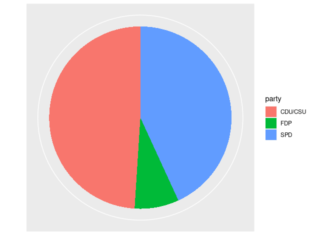

Aula 11
================

# Pacotes

``` r
library(ggplot2)
library(tidyverse)
library(ggforce)
```

# Carregando dados

``` r
bundestag <- tibble(
  party = c("CDU/CSU", "SPD", "FDP"),
  seats = c(243, 214, 39)
)
```

# Plotando pizzas com ggplot

``` r
bundestag %>% 
    ggplot(aes(seats, "YY", fill = party)) +
    geom_col() +
    coord_polar() +
    scale_x_continuous(
        name = NULL, breaks = NULL
    ) +
    scale_y_discrete(
        name = NULL, breaks = NULL
    )
```

<!-- -->

# Plotando pizzas com ggforce e `stat = "pie"`

## O básico

``` r
bundestag %>% 
    ggplot(
        aes(
            x0 = 0, y0 = 0,  #Definindo centro da pizza 
            r0 = 0, r = 1,   #Tamanho do raio interno e do raio externo
            amount = seats,  #Tamanho dos pedaços da pizza
            fill = party
        )
    ) +
    geom_arc_bar(stat = "pie") +
    coord_fixed()
```

<!-- -->

## Mudando a posição e o tamanho do gráfico

``` r
bundestag %>% 
    ggplot(
        aes(
            x0 = 1, y0 = 1,
            r0 = 0, r = 1,
            amount = seats,
            fill = party
        )
    ) +
    geom_arc_bar(stat = "pie") +
    coord_fixed(
        xlim = c(0, 4), ylim = c(0,4)
    )
```

<!-- -->

## Uma pizza sem centro

``` r
bundestag %>% 
    ggplot(
        aes(
            x0 = 2, y0 = 2,
            r0 = 1, r = 2,
            amount = seats,
            fill = party
        )
    ) +
    geom_arc_bar(stat = "pie") +
    coord_fixed(
        xlim = c(0, 4), ylim = c(0,4)
    )
```

<!-- -->

# Fazendo gráfico de pizza manualmente com ggforce

## Preparando dados da pizza

``` r
pie_data <- bundestag %>%
  arrange(seats) %>% # sort so pie slices end up sorted
  mutate(
    end_angle = 2*pi*cumsum(seats)/sum(seats),   # ending angle for each pie slice
    start_angle = lag(end_angle, default = 0),   # starting angle for each pie slice
    mid_angle = 0.5*(start_angle + end_angle),   # middle of each pie slice, for text labels
    # horizontal and vertical justifications for outer labels
    hjust = ifelse(mid_angle > pi, 1, 0),
    vjust = ifelse(mid_angle < pi/2 | mid_angle > 3*pi/2, 0, 1)
  )
```

## Plotando

``` r
ggplot(pie_data) +
  aes(
    x0 = 0, y0 = 0, r0 = 0, r = 1,
    start = start_angle, end = end_angle,
    fill = party
  ) +
  geom_arc_bar() +
  coord_fixed()
```

<!-- -->
