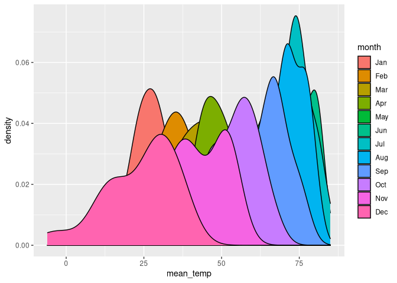
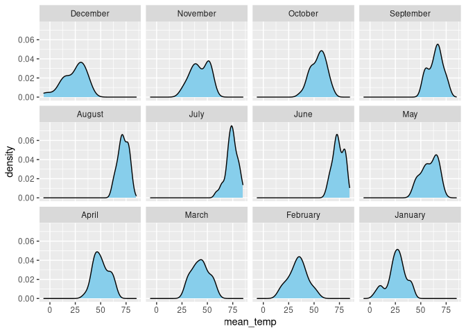
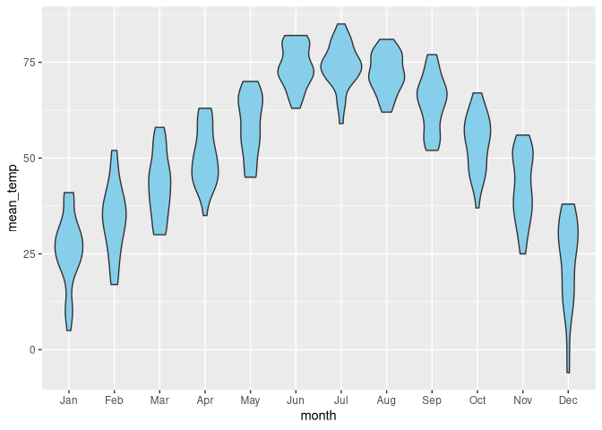
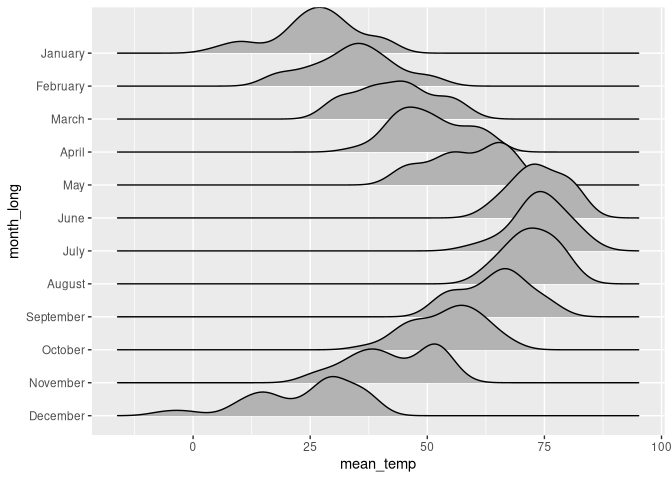

Aula 5
================

## Pacotes

``` r
library(tidyverse)
library(ggplot2)
library(ggforce)
library(ggridges)
```

## Carregando base de dados

``` r
lincoln_temps <- readRDS(url("https://wilkelab.org/SDS375/datasets/lincoln_temps.rds"))
```

# O que evitar fazer

## Gráficos de densidade se sobrepondo

``` r
lincoln_temps %>% 
    ggplot(aes(mean_temp, fill = month)) +
    geom_density()
```

<!-- -->

## Gráficos de densidade se “estacando”

``` r
lincoln_temps %>% 
    ggplot(aes(mean_temp, fill = month)) +
    geom_density(position = "stack")
```

<!-- -->

# Maneiras melhores de lidar com essa situação

## Vários gráficos menores

``` r
lincoln_temps %>% 
    ggplot(aes(mean_temp)) +
    geom_density(fill = "skyblue") +
    facet_wrap(vars(month_long))
```

<!-- -->

## Boxplot

``` r
lincoln_temps %>% 
    ggplot(aes(month, mean_temp)) +
    geom_boxplot(fill = "skyblue")
```

<!-- -->

## Violins

O autor explica como ler esse tipo de representação

Mas basicamente é um gŕafico de densidade girado em 90º e depois
espelhado

``` r
lincoln_temps %>% 
    ggplot(aes(month, mean_temp)) +
    geom_violin(fill = "skyblue")
```

<!-- -->

## Strip Chart

``` r
lincoln_temps %>% 
    ggplot(aes(month, mean_temp)) +
    geom_point(size = 0.75) # diminuindo o tamanho para evitar muita sobreposição dos pontos
```

<!-- -->

## Strip Chart com jitter

``` r
lincoln_temps %>% 
    ggplot(aes(month, mean_temp)) +
    geom_point(
        size = 0.75,      # diminuindo o tamanho para evitar muita sobreposição dos pontos
        position = position_jitter(
            width = 0.15, #jitter (tremor) horizontal 
            height = 0    #jitter vertical, no caso igual a 0 (sem tremor)
        )
    )
```

<!-- -->

## Sina plot

``` r
lincoln_temps %>% 
    ggplot(aes(month, mean_temp)) +
    geom_violin(fill = "skyblue", color = NA) +
    geom_sina(size = 0.75)
```

<!-- -->

## Comparando com `geom_point`

``` r
lincoln_temps %>% 
    ggplot(aes(month, mean_temp)) +
    geom_violin(fill = "skyblue", color = NA) +
    geom_point(
        size = 0.75,
        position = position_jitter(
            width = 0.15,
            height = 0
        )
    )
```

<!-- -->

## Ridgeline plot

``` r
lincoln_temps %>% 
    ggplot(aes(mean_temp, month_long)) +
    geom_density_ridges()
```

<!-- -->
