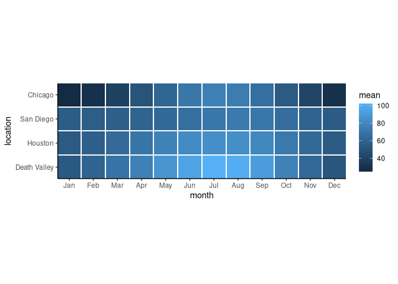
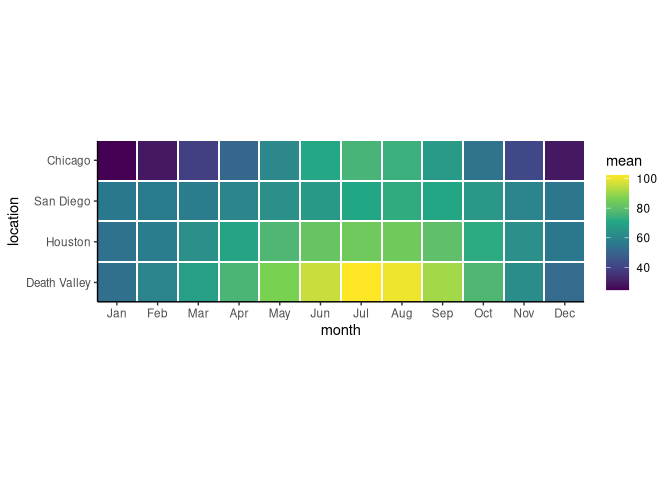
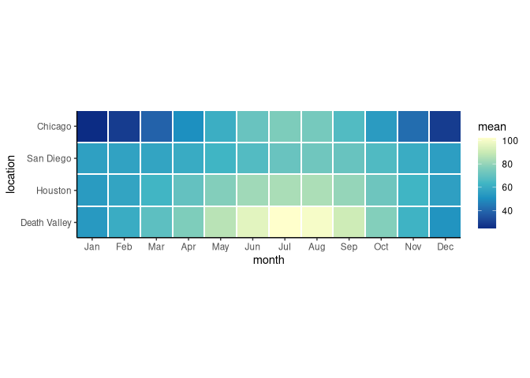

Aula 7
================

# Pacotes

``` r
library(tidyverse)
library(ggplot2)
library(colorspace)
library(gapminder)
```

# Carregando base de dados

``` r
temperatures <- read_csv("https://wilkelab.org/SDS375/datasets/tempnormals.csv") %>%
  mutate(
    location = factor(
      location, levels = c("Death Valley", "Houston", "San Diego", "Chicago")
    )
  ) %>%
  select(location, day_of_year, month, temperature)

temps_months <- read_csv("https://wilkelab.org/SDS375/datasets/tempnormals.csv") %>%
  group_by(location, month_name) %>%
  summarize(mean = mean(temperature)) %>%
  mutate(
    month = factor(
      month_name,
      levels = c("Jan", "Feb", "Mar", "Apr", "May", "Jun", "Jul", "Aug", "Sep", "Oct", "Nov", "Dec")
    ),
    location = factor(
      location, levels = c("Death Valley", "Houston", "San Diego", "Chicago")
    )
  ) %>%
  select(-month_name)
```

# Aprendendo sobre cores em gráficos

## Usando paleta de cores padrão

``` r
temps_months %>% 
    ggplot(aes(month, location, fill = mean)) +
    geom_tile(width = 0.95, height = 0.95) +
    coord_fixed(expand = FALSE) +
    theme_classic() +
    scale_fill_gradient() #Paleta de cores padrão
```

<!-- -->

## `viridis_c`

``` r
temps_months %>% 
    ggplot(aes(month, location, fill = mean)) +
    geom_tile(width = 0.95, height = 0.95) +
    coord_fixed(expand = FALSE) +
    theme_classic() +
    scale_fill_viridis_c() #Paleta de cores padrão
```

<!-- -->

### Definindo o parâmetro `option`

``` r
temps_months %>% 
    ggplot(aes(month, location, fill = mean)) +
    geom_tile(width = 0.95, height = 0.95) +
    coord_fixed(expand = FALSE) +
    theme_classic() +
    scale_fill_viridis_c(option = "B", begin = 0.15) #Paleta de cores padrão
```

<!-- -->

## Paleta YlGnBu

``` r
temps_months %>% 
    ggplot(aes(month, location, fill = mean)) +
    geom_tile(width = 0.95, height = 0.95) +
    coord_fixed(expand = FALSE) +
    theme_classic() +
    scale_fill_distiller(palette = "YlGnBu")
```

<!-- -->

# Pacote colorspace

Pacote usado para facilitar a organização da bagunça que é a sintaxe do
ggplot

A ideia do pacote é usar a seguinte sintaxe
**scale\_<aesthetic>*<datatype>*<colorscale>()**

## YlGnBu

``` r
temps_months %>% 
    ggplot(aes(month, location, fill = mean)) +
    geom_tile(width = 0.95, height = 0.95) +
    coord_fixed(expand = FALSE) +
    theme_classic() +
    scale_fill_continuous_sequential(palette = "YlGnBu", rev = FALSE)
```

<!-- -->

## Viridis

``` r
temps_months %>% 
    ggplot(aes(month, location, fill = mean)) +
    geom_tile(width = 0.95, height = 0.95) +
    coord_fixed(expand = FALSE) +
    theme_classic() +
    scale_fill_continuous_sequential(palette = "Viridis", rev = FALSE)
```

<!-- -->

## Inferno

``` r
temps_months %>% 
    ggplot(aes(month, location, fill = mean)) +
    geom_tile(width = 0.95, height = 0.95) +
    coord_fixed(expand = FALSE) +
    theme_classic() +
    scale_fill_continuous_sequential(palette = "Inferno", begin = 0.15, rev = FALSE)
```

<!-- -->

# Paletas de cores qualitativas manualmente

## Padrão

O padrão no caso é `scale_color_hue()`

Infelizmente o autor não disponibilizou os dados para que eu pudesse
reproduzir os resultados, mas o principal da aula em relação a cores
está presente nos gráficos feitos com os dados de temperatura
