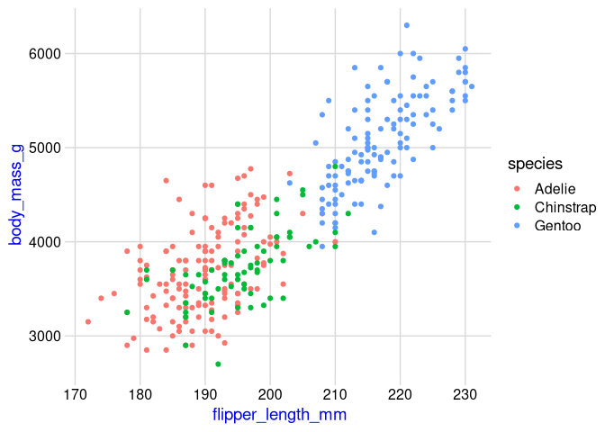

Aula 6
================

# Pacotes

``` r
library(ggplot2)
library(tidyverse)
library(ggridges)
library(cowplot)
library(palmerpenguins)
library(ggthemes)
```

# Carregando base de dados

``` r
lincoln_temps <- readRDS(url("https://wilkelab.org/SDS375/datasets/lincoln_temps.rds"))
```

# Como estilizar um gráfico

## Rascunho

``` r
lincoln_temps %>% 
    ggplot(aes(mean_temp, month_long)) +
    geom_density_ridges()
```

<!-- -->

## `scale` e `bandwidth` para formatar o gráfico

``` r
lincoln_temps %>% 
    ggplot(aes(mean_temp, month_long)) +
    geom_density_ridges(
        scale = 3,
        bandwidth = 3.4
    )
```

<!-- -->

## `rel_min_height`

``` r
lincoln_temps %>% 
    ggplot(aes(mean_temp, month_long)) +
    geom_density_ridges(
        scale = 3,
        bandwidth = 3.4,
        rel_min_height = 0.01
    )
```

<!-- -->

## `scales_*`

``` r
lincoln_temps %>% 
    ggplot(aes(mean_temp, month_long)) +
    geom_density_ridges(
        scale = 3,
        bandwidth = 3.4,
        rel_min_height = 0.01
    ) +
    scale_y_discrete(
        name = NULL
    ) +
    scale_x_continuous(
        name = "média de temperatura (ºF)"
    )
```

<!-- -->

## Definindo expansão da escala

``` r
lincoln_temps %>% 
    ggplot(aes(mean_temp, month_long)) +
    geom_density_ridges(
        scale = 3,
        bandwidth = 3.4,
        rel_min_height = 0.01
    ) +
    scale_y_discrete(
        name = NULL
    ) +
    scale_x_continuous(
        name = "média de temperatura (ºF)",
        expand = expansion(add = c(0.2, 2.6))
    )
```

<!-- -->

## Defindo tema

``` r
lincoln_temps %>% 
    ggplot(aes(mean_temp, month_long)) +
    geom_density_ridges(
        scale = 3,
        bandwidth = 3.4,
        rel_min_height = 0.01
    ) +
    scale_y_discrete(
        name = NULL
    ) +
    scale_x_continuous(
        name = "média de temperatura (ºF)",
        expand = expansion(add = c(0.2, 2.6))
    ) +
    theme_minimal_grid() +
    theme(
        axis.text.y = element_text(vjust = 0)
    )
```

<!-- -->

## Definindo cor e contorno

``` r
lincoln_temps %>% 
    ggplot(aes(mean_temp, month_long)) +
    geom_density_ridges(
        scale = 3,
        bandwidth = 3.4,
        rel_min_height = 0.01,
        fill = "#03b0ff",
        color = "white"
    ) +
    scale_y_discrete(
        name = NULL
    ) +
    scale_x_continuous(
        name = "média de temperatura (ºF)",
        expand = expansion(add = c(0.2, 2.6))
    ) +
    theme_minimal_grid() +
    theme(
        axis.text.y = element_text(vjust = 0)
    )
```

<!-- -->

# Usando temas prontos

## Tema padrão (`theme_gray`)

;

``` r
penguins %>% 
    ggplot(aes(flipper_length_mm, body_mass_g, color = species)) +
    geom_point() +
    theme_gray(14) # mudando o tamanho da fonte
```

<!-- -->

## `theme_bw`

``` r
penguins %>% 
    ggplot(aes(flipper_length_mm, body_mass_g, color = species)) +
    geom_point() +
    theme_bw(14)
```

<!-- -->

## `theme_minimal`

``` r
penguins %>% 
    ggplot(aes(flipper_length_mm, body_mass_g, color = species)) +
    geom_point() +
    theme_minimal(14)
```

<!-- -->

## `theme_classic`

``` r
penguins %>% 
    ggplot(aes(flipper_length_mm, body_mass_g, color = species)) +
    geom_point() +
    theme_classic(14)
```

<!-- -->

## `theme_half_open` (do pacote cowplot)

``` r
penguins %>% 
    ggplot(aes(flipper_length_mm, body_mass_g, color = species)) +
    geom_point() +
    theme_half_open(14)
```

<!-- -->

## `theme_minimal_grid` (do pacote cowplot)

``` r
penguins %>% 
    ggplot(aes(flipper_length_mm, body_mass_g, color = species)) +
    geom_point() +
    theme_minimal_grid(14)
```

<!-- -->

## `theme_minimal_vgrid` (do pacote cowplot)

``` r
penguins %>% 
    ggplot(aes(flipper_length_mm, body_mass_g, color = species)) +
    geom_point() +
    theme_minimal_vgrid(14)
```

<!-- -->

## `theme_minimal_hrid` (do pacote cowplot)

``` r
penguins %>% 
    ggplot(aes(flipper_length_mm, body_mass_g, color = species)) +
    geom_point() +
    theme_minimal_hgrid(14)
```

<!-- -->

## `theme_economist` (do pacote ggthemes)

``` r
penguins %>% 
    ggplot(aes(flipper_length_mm, body_mass_g, color = species)) +
    geom_point() +
    theme_economist(14) +
    scale_color_economist()
```

<!-- -->

## `theme_fivethirtyeight` (do pacote ggthemes)

``` r
penguins %>% 
    ggplot(aes(flipper_length_mm, body_mass_g, color = species)) +
    geom_point() +
    theme_fivethirtyeight(14) +
    scale_color_fivethirtyeight()
```

<!-- -->

# Customizando elementos do tema

## Fonte do texto

``` r
penguins %>% 
    ggplot(aes(flipper_length_mm, body_mass_g, color = species)) +
    geom_point() +
    theme_minimal_grid() +
    theme(
        text = element_text(
            family = "Comic Sans MS"
        )
    )
```

<!-- -->

## Cor do texto

``` r
penguins %>% 
    ggplot(aes(flipper_length_mm, body_mass_g, color = species)) +
    geom_point() +
    theme_minimal_grid() +
    theme(
        axis.title = element_text(
            color = "blue"
        )
    )
```

<!-- -->

## Alinhamento horizontal

``` r
penguins %>% 
    ggplot(aes(flipper_length_mm, body_mass_g, color = species)) +
    geom_point() +
    theme_minimal_grid() +
    theme(
        axis.title.x = element_text(
            hjust = 0 # 0 = esquerda, 0.5 = centro, 1 = direita
        )
    )
```

<!-- -->

## Alinhamento vertical

``` r
penguins %>% 
    ggplot(aes(flipper_length_mm, body_mass_g, color = species)) +
    geom_point() +
    theme_minimal_grid() +
    theme(
        axis.text.y = element_text(
            vjust = 1 # 1 = topo, 0.5 = centro, 0 = baixo
        )
    )
```

<!-- -->

## Cor de fundo

``` r
penguins %>% 
    ggplot(aes(flipper_length_mm, body_mass_g, color = species)) +
    geom_point() +
    theme_minimal_grid() +
    theme(
        plot.background = element_rect(
            fill = "aliceblue"
        )
    )
```

<!-- -->

## Posição da legenda

``` r
penguins %>% 
    ggplot(aes(flipper_length_mm, body_mass_g, color = species)) +
    geom_point() +
    theme_minimal_grid() +
    theme(
        legend.box.background = element_rect(
            fill = "aliceblue"
        ), # colore o fundo da legenda
        legend.box.margin = margin(7, 7, 7, 7), # define as margens
        legend.position = c(1,0), # muda a posição
        legend.justification = c(1,0) # justificação relativa a posição
    )
```

<!-- -->
