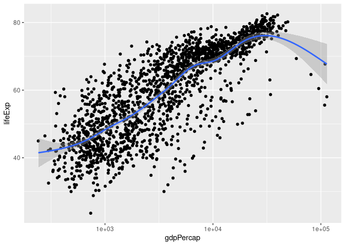

Capítulo 3 - Kieran Healy
================
João Xavier

## Pacotes

``` r
library(tidyverse)
library(ggplot2)
library(magrittr)
library(gapminder)
library(scales)
```

## Comentários

-   O autor faz alguns comentários sobre o formato dos dados

-   Faz distinção entre o formato wide e tidy, que é usado pelo ggplot

-   Vou usar o dataset gapminder

-   Como vou construir vários gráficos com o mesmo dataset é
    interessante definir um objeto base para simplificar o código

``` r
p <- gapminder %>%
    ggplot(aes(gdpPercap, lifeExp))
```

## Primeiro gráfico de pontos mais simples

``` r
p +
    geom_point()
```

<!-- -->

## Usando um tipo diferente de geom

``` r
p + 
    geom_smooth()
```

<!-- -->

## Combinando os dois gráficos anteriores mas fazendo uma regressão linear

``` r
p +
    geom_point() + 
    geom_smooth(method = "lm")
```

<!-- -->

## Ajustando a escala do eixo x para que o gráfico fique mais legível

``` r
p +
    geom_point() +
    geom_smooth(method = "gam") +
    scale_x_log10()
```

<!-- -->

## Ajustando a notação da escla do eixo x com o pacote scales

``` r
p + 
    geom_point() + 
    geom_smooth(method = "gam") +
    scale_x_log10(labels = scales::dollar)
```

    ## `geom_smooth()` using formula 'y ~ s(x, bs = "cs")'

<!-- -->

-   O autor observa que para colorir um objeto se deve passar o
    argumento color
-   Fora da função aes para que não ocorra nenhum erro e o R interprete
    mal

## Colorindo o gráfico

``` r
p + 
    geom_point(color = "red") + 
    geom_smooth(method = "loess") +
    scale_x_log10(labels = scales::dollar)
```

<!-- -->

## Adicionando elementos como título e legendas, além de transparência nos pontos

``` r
p +
    geom_point(alpha = 0.3) +
    geom_smooth(method = "lm", se = FALSE) +
    scale_x_log10(labels = scales::dollar) +
    labs(
        x = "PIB per capita",
        y = "Expectativa de vida",
        title = "Crescimento econômico e expectativa de vida",
        subtitle = "Os pontos são dados por anos e países",
        caption = "Fonte: Gapminder"
    )
```

<!-- -->

# Colorindo o gŕafico de acordo com os continentes usando o aes

``` r
gapminder %>% 
    ggplot(aes(gdpPercap, lifeExp, color = continent, fill = continent)) +
    geom_point() + 
    geom_smooth() +
    scale_x_log10()
```

<!-- -->

# Deixando o gŕafico um pouco menos confuso com o ajuste feito nos geoms

``` r
gapminder %>% 
    ggplot(aes(gdpPercap, lifeExp)) +
    geom_point(aes(color = continent, fill = continent)) + 
    geom_smooth() +
    scale_x_log10()
```

<!-- -->

# Usando uma variável contínua no argumento color

``` r
p + 
    geom_point(aes(color = log(pop))) +
    scale_x_log10()
```

<!-- -->
